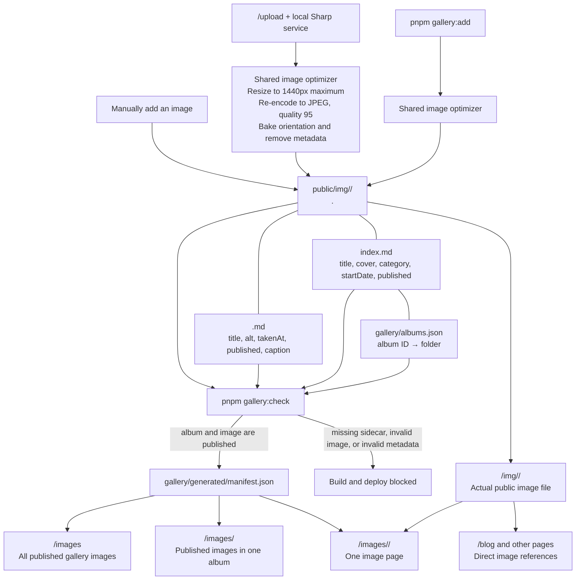

# Content authoring

This repository has two local-only authoring pages:

- `/write` creates and edits blog posts.
- `/upload` creates and manages image-gallery albums and photos.

Use `pnpm write` or `pnpm upload` to start the development server and open the
right authoring page. `pnpm start` remains available when you want the whole
site without opening an editor.

Both pages use the browser's File System Access API, so the first connection
still requires selecting this repository's root directory and granting
read/write access. A command line tool cannot grant that browser permission or
pass a directory handle to the page. The Connect repository button is focused
when opened through either authoring command, and Chrome or Edge remembers the
last directory used for this site. The saved directory handle stays only in that
browser's local IndexedDB storage; neither page uploads files to a server or
commits/pushes Git changes.

They deliberately return 404 in production, so they are not deployed to the
public site.

## `/write`: blog posts

`/write` reads and writes Markdown files in `src/blog`. It provides a Markdown
editor, live preview, tags, draft status, and a list of existing posts.

- Saving creates or updates a post Markdown file with its front matter.
- Unsaved edits are kept locally in the browser and can be restored after a
  crash or accidental tab closure. They are not written to the repository until
  Save is selected.
- Saving a draft keeps it private to the repository; commit and push only when
  it is ready to publish.
- Deleting a post removes its Markdown file after confirmation.
- Image uploads are written to `public/img/blog` as WebP files. They are
  browser-reencoded at quality 0.86, limited to 2400px on the longest side,
  and have EXIF and other embedded metadata removed. `/write` inserts the
  resulting Markdown image reference for you.

## `/upload`: gallery albums and images

`/upload` manages `gallery/albums.json` plus the folders it references under
`public/img`.

An album has a stable ID and a configurable source path. Its folder contains:

```text
public/img/travel/example-trip/
  index.md       # album title, dates, category, cover, and publication state
  beach.jpg      # sanitised source image
  beach.md       # title, alt text, caption, and publication state
```

The page can create an album, choose its category and cover, edit album
metadata, upload one or more photos at once, and edit each photo's accessible
text and caption. Gallery categories are Travel, Blog, Random, and
Screenshots. Image dates use the browser's date picker; use **Auto-fill from
image dates** to set an album's start and end dates from its dated images.
Unsaved album and image metadata is recoverable locally in the browser; it does
not write to the repository until Save is selected.
`pnpm start` runs a local-only Sharp service alongside Next.js, so `/upload`
works whether it is opened through `pnpm upload` or visited from an ordinary
local development session. Both it and `pnpm gallery:add` use the same image
optimizer: it reduces images to 1440px on their longest edge, reencodes them as
quality-95 JPEGs, bakes orientation into pixels, and removes embedded metadata.
Their filename base is retained; for example, `sunset.png` becomes
`sunset.jpg`. The uploader sends up to four images to this local service at
once. **Optimize all images** applies the same process to every unprocessed
image in the selected album without changing its image metadata. Afterward, the
control reports that the album is already optimized instead of reprocessing the
files.

Pressing Ctrl+C stops both the local HTTP listener and Next.js's development
runtime. A subsequent `pnpm start` can reuse the same port without manual
cleanup.

Mark both the album and an image as published before it appears in the gallery.
`published: false` prevents it from appearing in gallery pages, but files under
`public/img` are static public assets after deployment. Do not put confidential
or unsanitised material there.

Before every commit, the pre-commit hook checks every staged image added or
modified below `public/img`. It blocks images larger than 25 MiB or 100 million
pixels; use `/upload` or `pnpm gallery:add` to re-encode oversized originals.

## How the gallery is built

`gallery/albums.json` maps a stable gallery ID to an arbitrary folder below
`public/img`; neither the folder name nor image filename needs to follow a
convention. Album IDs may use slash-separated, lowercase path segments to make
nested gallery folders. For example, an album with ID `screenshots/celeste`
and path `public/img/screenshots/celeste` is browsed at
`/images/screenshots/celeste/`; `/images/screenshots/` becomes its containing
folder. A registered album cannot also be a containing folder, so put images
in the leaf game folders rather than the `screenshots` folder itself.



An image appears in gallery pages only if all of these conditions hold:

1. Its folder is registered as an album in `gallery/albums.json`.
2. The album's `index.md` has `published: true`.
3. The image has a matching `.md` sidecar with `published: true`.

Files below `public/img` are always public at their `/img/**` URL after a
deployment. A blog post can therefore use an image directly even when that
image is not published in the image gallery.

During each build:

1. `pnpm gallery:check` validates album configuration, image sidecars, and
   required accessibility metadata for published images.
2. `pnpm gallery:build` reads published albums/images and creates
   `gallery/generated/manifest.json` for the gallery pages. All displayed
   images remain at their canonical `/img/**` paths.
3. Next.js renders `/images`, each album page, and individual photo
   pages from that manifest.

The `/images` timeline groups all published images by calendar year. Individual
image and album metadata retains their more specific dates.

The generated manifest is ignored by Git and recreated for every build.
GitHub Actions runs the gallery validation, generation, and site build on
pushes to `main` before publishing the static site.

## Command-line alternative

For one-off terminal uploads, use:

```sh
pnpm gallery:add ~/Pictures/photo.jpg --album my-trip --category travel
```

It creates the same quality-95 JPEG, strips metadata, and adds a Markdown
sidecar. The album must already exist in `gallery/albums.json`; `/upload` is
the easier way to create and organise albums.
